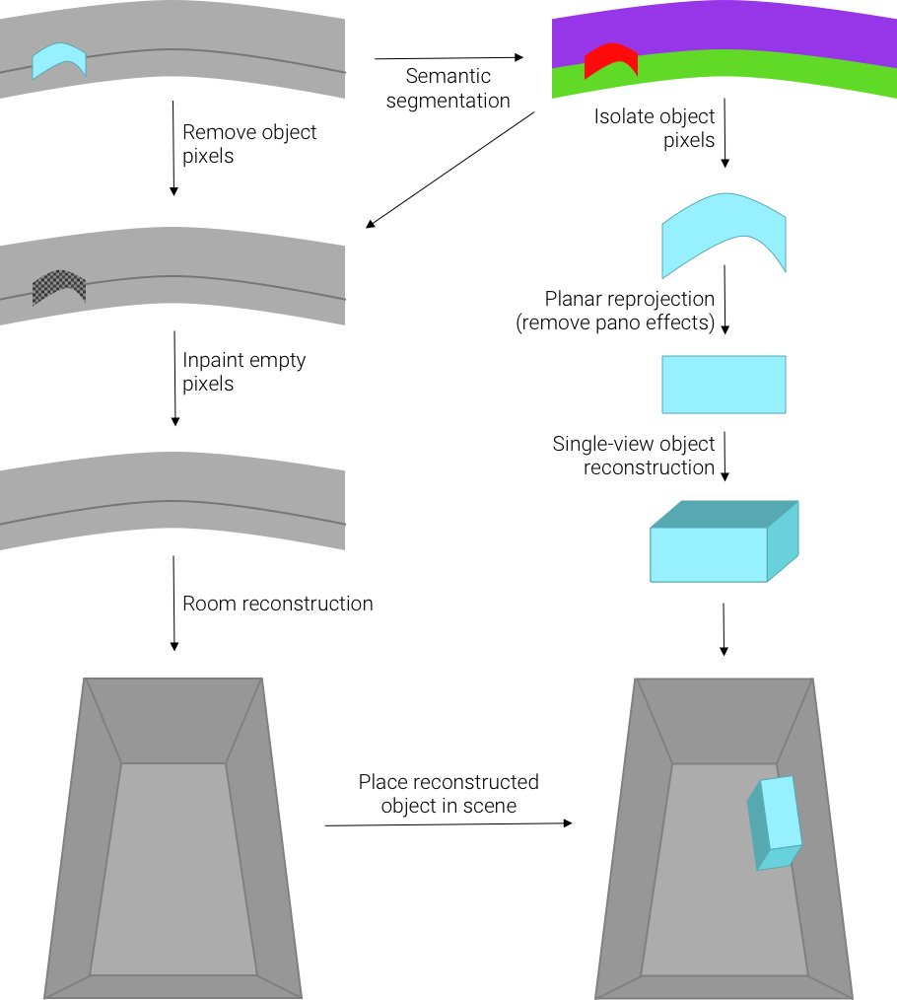

# Enhanced-3D-Room-Reconstruction
COMP 790-156 term project
UNC Chapel Hill

We tackle the problem of removing object distortion in 3D Room Reconstruction from single Panoramic Image. Previous works like RoomNet, HorizonNet, DuLANet, and LayoutNet use deep learning techniques for solving this task and couple that with some preprocessing (to process the panoramic image) and post-processing (convert network output to a 3d room) steps to achieve the final room reconstruction. One of the common issues with all of these works is that the reconstructed objects in the final room appear quite distorted and definitely have a lot of room for improvement. 

# Proposed Pipeline
We created a process involving segmenting out objects which are likely to be distorted in the room reconstruction, and inpainting over these objects in the original panoramic image. Then running a room reconstruction method on this new panoramic image provides an “empty” 3D scene. Using the semantic segmentation from the first step, we can utilize a single-view object reconstruction method to derive a 3D reconstruction of the object which was removed from the scene. Finally, this 3D object can be inserted into the empty reconstructed room.

